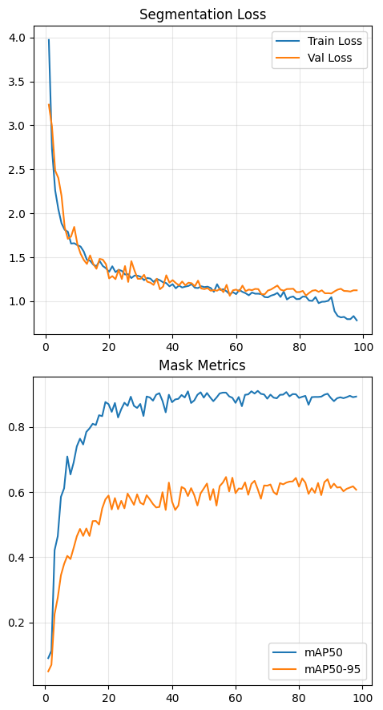
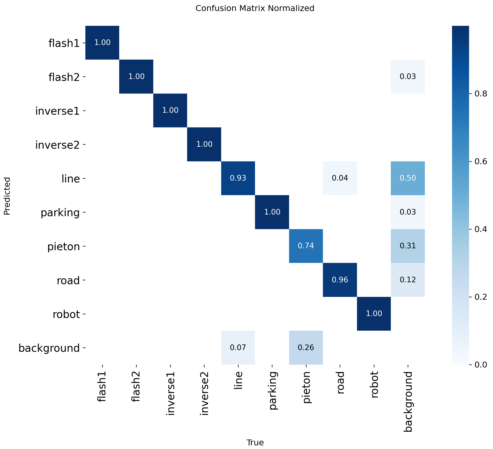

# ROS Autonomous Navigation with YOLOv8
# 基于 YOLOv8 的 ROS 自主导航系统

A fully autonomous navigation system for a Turtlebot3. The robot uses a single Raspberry Pi camera to perceive its environment via yolov8n-seg and navigates the track using a Finite State Machine with artificial potential fields method. It can stay on track, stop for pedestrians (crosswalk), avoid obstacles, and autonomously park.
本项目是一个为 Turtlebot3 开发的自主导航系统。机器人仅依赖单目树莓派摄像头，通过 yolov8n-seg 模型感知环境，并结合人工势场法及状态机完成巡航。系统支持车道保持、行人避让（斑马线）、动态避障以及自动泊车功能。

## Tech Stack & Pipeline

1.  **Hardware**: Turtlebot3, Raspberry Pi Camera.
2.  **Perception (Vision)**: 
    * Model: **YOLOv8n-seg** (Instance Segmentation).
    * Input: Low-resolution images (128x128) for real-time inference on edge devices (10 FPS).
    * Classes: Road, Lines, Traffic Signs (Flash, Inverse), Obstacles (Robots, Crosswalk), Parking Spots.
    * Data Augmentation: Heavy brightness/saturation variation to counter real-world lighting changes.
3.  **Control Logic**: 
    * Architecture: **ROS (Robot Operating System)**.
    * Default Mode: Proportional control paired with **Artificial Repulsion Fields** (avoiding boundary lines).
    * Decision Making: **Finite State Machine (FSM)** handling sequential missions and high-priority safety interrupts (e.g., stopping for other robots, emergency U-turns).

## Project Structure

- **`src/NavigAuto.py`**: The ROS perception node. Runs YOLOv8 inference, calculates road centroids, generates repulsion forces, and publishes a perception data vector `(x, y, z)`(x: directional control via error + repulsion, y: state transitions & safety interrupts, z: task-specific lateral guidance like parking).
- **`src/ControleurNavig.py`**: The ROS control node. Implements the FSM to process perception data vector, manage mission states (Cruise, Wait, U-Turn, Parking), and publish `/cmd_vel` motor commands.
- **`src/30_bright_train.ipynb`**: Model training script for google colab. Includes aggressive data augmentation strategies (±30% brightness) to ensure robustness against environmental lighting changes.

## Usage Note

1.  **Dependencies**: ROS (Noetic/Melodic), Python 3, `ultralytics` (YOLOv8), `cv_bridge`, OpenCV.
2.  **Execution**: The perception and control nodes run asynchronously to ensure the control loop remains unblocked by image processing times.
3.  **Paths**: If re-training the model, update the local workspace paths and Roboflow API configurations in the training script.

## Results

### 1. Test Environment (The Track)
The physical track used for testing, featuring intersections, crosswalks, parking zones, and directional signs.
 

  

 

### 2. Real-time Segmentation Predictions
Model predictions on the validation set. Even at 128x128 resolution, the model successfully segments the navigable road and identifies traffic signs.
 

  

 

### 3. Training Performance
The loss decreases steadily and mAP metrics stabilize around epoch 78, showing good convergence without major overfitting.
 

  

 

### 4. Confusion Matrix
Detailed classification performance. The model achieves excellent detection for roads and signs, essential for the reactive navigation task.
 

  

---
*Disclaimer: This repository is for archiving and educational purposes.*